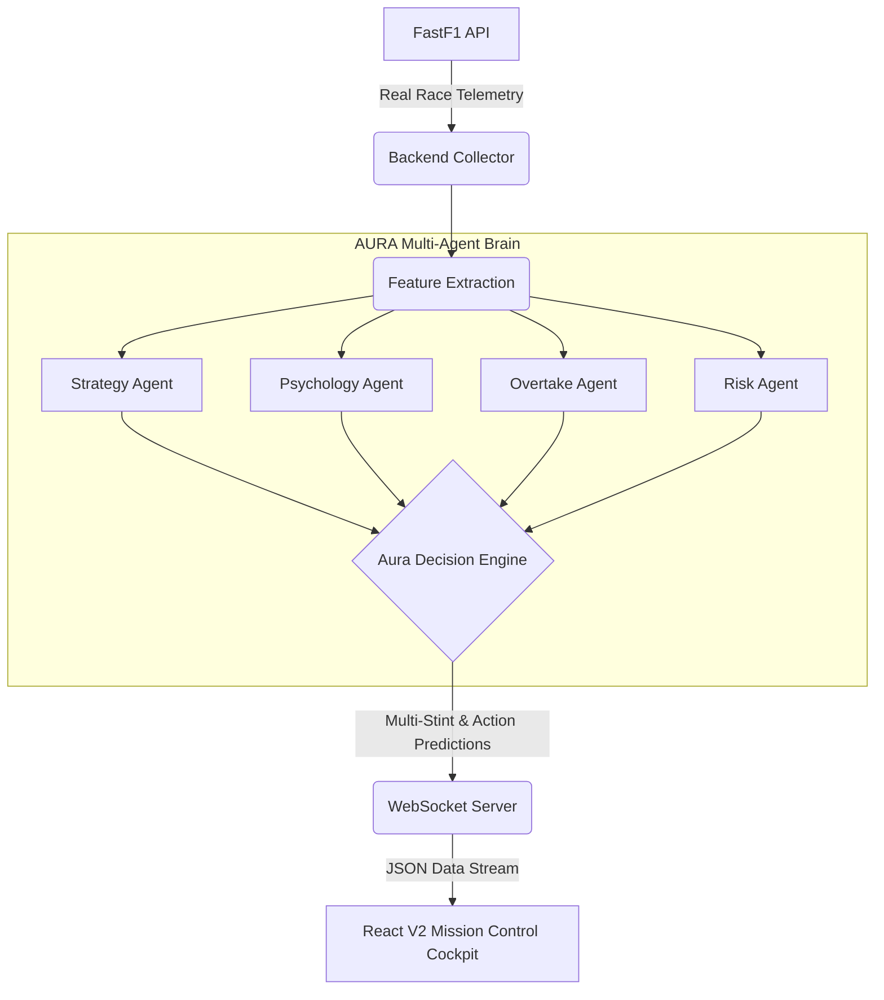
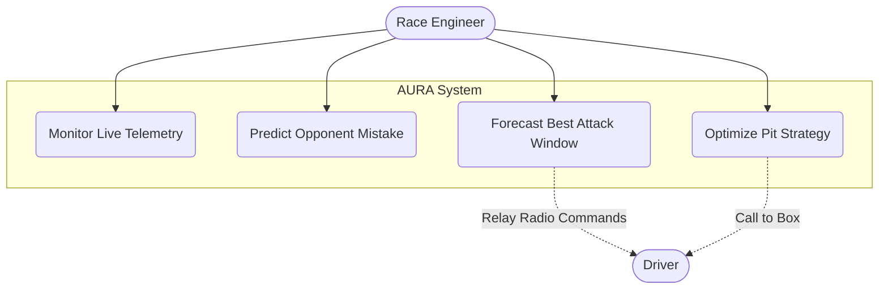
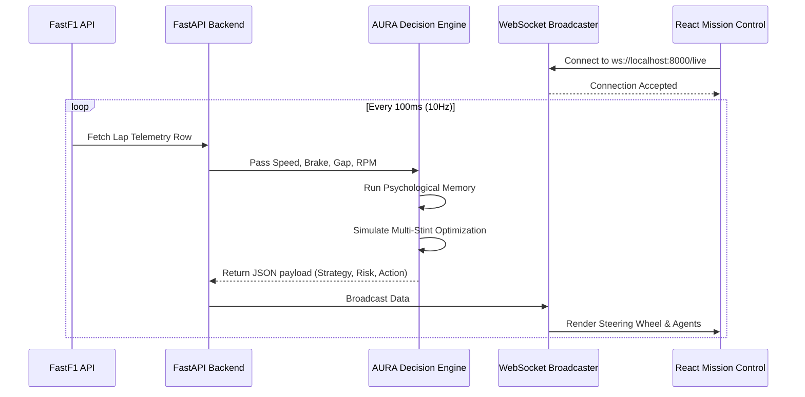
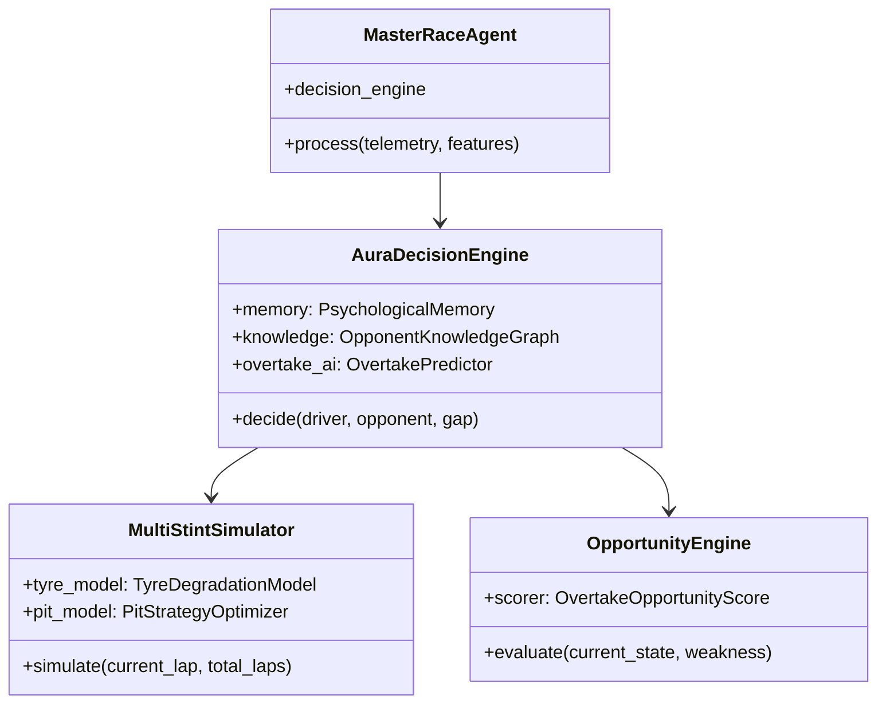
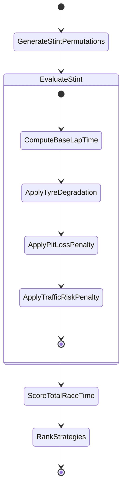

# 🏎️ AURA-Race AI: F1 Pit-Wall Engineering System

AURA-Race AI is an advanced, multi-agent Formula 1 race engineering and strategy simulator. It transitions traditional motorsport data analytics from static telemetry dashboards into an active, predictive **Mission Control AI**. 

By leveraging the `FastF1` library to ingest real-world Formula 1 telemetry, AURA acts as an autonomous Race Engineer—predicting opponent mistakes under pressure, analyzing real-time overtake opportunities, and projecting multi-stint pit strategies.

---

## 🌟 Key Capabilities
1. **Psychological Memory Engine**: Predicts the exact probability of an opponent making a mistake (e.g. late braking) based on dynamic pressure from the trailing car.
2. **Adaptive Overtake Forecasting**: Doesn't just calculate *if* an overtake is possible, but predicts *when* (e.g., "Attack T10 on Lap 46").
3. **Multi-Stint Race Optimizer**: Evaluates thousands of race paths (Undercuts, Overcuts, Push Stints) factoring in Tyre Degradation and Pit Lane traffic risk.
4. **Mission Control Dashboard**: A highly authentic, dark-mode React interface streaming WebSocket telemetry at 10Hz, rendering F1 digital steering wheels, timing towers, and live Multi-Agent decision confidences.

---

## 🏗️ System Architecture



---

## 👤 Use Case Diagram



---

## 🔄 Sequence Diagram: Live Telemetry Flow



---

## 📦 Class Diagram: Multi-Agent Core



---

## ⚡ Activity Diagram: Multi-Stint Strategy Evaluation



---

## 🚀 Running the Project

### 1. Start the Backend (Uvicorn / FastAPI)
The core engine runs on a FastAPI WebSocket server.
```bash
# Navigate to project root
source .venv/bin/activate
uvicorn backend.main:app --reload --port 8000
```

### 2. Start the Frontend (React / Vite)
The UI simulates a trackside engineering pit-wall.
```bash
cd frontend
npm run dev
```

Visit `http://localhost:5173` to view the Live Telemetry Dashboard.
